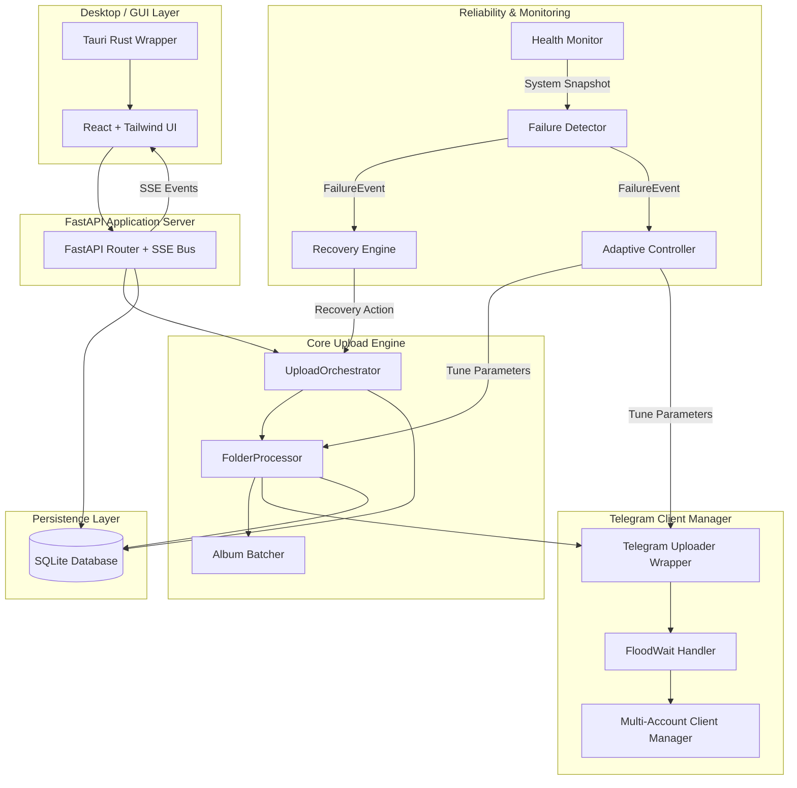

# TeleGallery

[](https://fastapi.tiangolo.com)
[](https://react.dev)
[](https://tauri.app)
[](https://sqlite.org)
[](https://www.docker.com)
[](https://opensource.org/licenses/MIT)

**TeleGallery** is a production-grade, highly resilient Telegram photo gallery uploader designed to handle massive libraries (50GB to 500GB+). It scans local folders recursively, clusters images into deterministic album media groups (up to 10 photos per group), and uploads them to your Telegram channels.

Built for unattended, long-running operations, TeleGallery implements an advanced self-healing reliability layer, TCP-style adaptive congestion control (AIMD), and detailed telemetry monitoring to survive API rate limiting, crashes, memory pressure, and network fluctuations.

---

## Key Features

- 📁 **Recursive Folder Scanning** — Preserves local folder structures and translates them into Telegram message boundaries.
- 📸 **Automatic Album Batching** — Group photos into clean, cohesive 10-image albums (the maximum Telegram limit) or sends individual files as single photos if left over.
- 🔄 **Stateful Resumability** — Tracks upload status down to individual files in SQLite, enabling safe resume after crashes or restarts without duplicating uploads.
- ⏸ **Lifecycle Controls** — Full controls to Pause, Resume, or Stop active upload sessions dynamically.
- 🌊 **Intelligent FloodWait Handling** — Auto-detects rate limits, manages cooldown countdowns, and resumes uploads automatically.
- 👥 **Multi-Account Failover & Load Balancing** — Swaps to backup connected accounts during a FloodWait to keep the queue moving.
- 📈 **Adaptive Congestion Control** — Dynamically adjusts batch size, concurrency, compression quality, and inter-upload pacing using TCP-style AIMD.
- 📊 **Dynamic ETA Analyzer** — Blends Exponential Moving Averages (EMA) with rolling median performance and bottleneck analysis to compute precise upload ETAs.
- 📋 **Integrated Logs & Auditing** — Color-coded real-time structured logs and error tracking directly in the user interface.
- 🛠 **Failed Upload Panel** — Audit, re-queue, or export individual upload failures to CSV.
- 🐳 **Docker Deployment** — Ready-to-go Docker configuration for headless backend operation.
- 💻 **Desktop Mode (Tauri)** — Optional native desktop wrapper (powered by Rust) for a seamless application experience.

---

## System Architecture

TeleGallery is split into an independent React frontend (which can run in a browser or as a Tauri desktop shell) and a FastAPI backend orchestrator running Pyrogram MTProto clients.



For a comprehensive explanation of state machines, resume sequences, and sequencing details, refer to the [System Architecture Guide](file:///c:/Tanush/TelleyGallary/docs/ARCHITECTURE.md).

---

## Advanced Reliability & Adaptive Control (v2.0)

TeleGallery's core strength is its self-healing upload loop, designed to run headless for days without stalling.

### 1. The Health Monitor
A background service that samples system stats every 10 seconds, collecting:
- **CPU & RAM**: Tracking memory usage (RSS in MB) and checking for linear growth trends to detect leaks.
- **Event Loop Lag**: Measures asyncio event loop scheduling delays in milliseconds.
- **Database Latency**: RTT measurements on SQLite queries.
- **Telegram Connection Pool**: Count of total and connected client sessions.

### 2. The Failure Detector
Analyzes metrics and logs to emit `FailureEvent` alerts when anomalous conditions are met:
- **Upload Stall**: Detects if no files have completed uploading for a threshold period (default: 5 minutes).
- **Retry Storm**: Triggers if the backend's internal retry rate exceeds a safe limit (e.g., >10 retries/min).
- **Throughput Collapse**: Flags if speed drops below 20% of the rolling historical mean.
- **Resource Exhaustion**: Flags elevated event loop lag, slow DB queries, or memory pressure.

### 3. The Recovery Engine (Self-Healing)
Subscribes to the Failure Detector and executes automated self-healing procedures:
- **GC & Memory Reclamation**: Forces Python garbage collection (generation 2) and flushes PIL's internal tile cache when memory pressure is detected.
- **Worker Reboots**: Automatically cancels stuck upload tasks and re-spawns execution workers during upload stalls.
- **Client Recreation**: Destroys and recreates Pyrogram client objects if multiple reconnection clusters or connection drops occur in a short window.
- **Pacing Adjustments**: Automatically applies pacing buffers or concurrency limits.

### 4. The Adaptive Controller (AIMD Congestion Control)
Uses an **Additive-Increase/Multiplicative-Decrease** (AIMD) algorithm to dynamically scale performance parameters:
- **Additive Increase**: When uploads complete successfully without rate-limiting, the controller slowly increases concurrent uploads ($+1$), increases album sizes ($+1$ up to $10$), and reduces inter-upload pacing delays.
- **Multiplicative Decrease**: Upon hitting a FloodWait, retry storm, or throughput collapse, the controller immediately halves ($0.5x$) concurrent uploads and album batch sizes while increasing pacing.
- **Dynamic Quality Scaling**: If the host machine is running low on RAM, the controller reduces the JPEG re-encode quality threshold (from $85$ down to $60$) to minimize the memory footprint of photo resizing operations, restoring quality once pressure subsides.

### 5. Blended ETA Analyzer
Provides stable, non-flapping ETAs by blending three distinct estimation algorithms:
1. **EMA Estimation (50% weight)**: Adapts rapidly to sudden changes in network speed.
2. **Rolling Window Median (30% weight)**: Discards performance anomalies and outliers.
3. **Per-Phase Projection (20% weight)**: Decomposes uploads into *preprocess ➔ disk-read ➔ network-upload ➔ API-latency* and sums the bottleneck delays.
*Outputs include optimistic/pessimistic bounds based on speed jitter and bottleneck phase identification (e.g., indicating whether the disk, CPU, or network is the current limiting factor).*

### 6. Prometheus Integration
Exposes detailed telemetry at `/api/metrics` in Prometheus-compatible text format for integration with Grafana.

---

## Folder ➔ Telegram Layout

TeleGallery scans your root folder, creating structured boundary posts for folders, and groups files sequentially:

```
Wedding/
├── Haldi/        ➔   🎉 HALDI PHOTOS START 🎉
│                     [album 1 (10 photos)] [album 2 (10 photos)] ...
│                     ✅ HALDI PHOTOS END ✅
├── Mehendi/      ➔   🎉 MEHENDI PHOTOS START 🎉
│                     [album 1 (10 photos)] [album 2 (10 photos)] ...
│                     ✅ MEHENDI PHOTOS END ✅
└── Reception/    ➔   🎉 RECEPTION PHOTOS START 🎉
                      [album 1 (10 photos)] [album 2 (10 photos)] ...
                      ✅ RECEPTION PHOTOS END ✅
```

---

## Technical Stack

| Component | Technology | Description |
|---|---|---|
| **Frontend** | React 18 + TypeScript + Tailwind CSS | Dynamic, responsive web dashboard with dark-mode defaults. |
| **State** | Zustand | Light-weight, reactive store management. |
| **Backend API**| FastAPI + Uvicorn | High-performance asynchronous REST endpoints and SSE event bus. |
| **Telegram API**| Pyrogram (MTProto) | Asynchronous Telegram client implementation. |
| **Database** | SQLite + SQLAlchemy (aiosqlite) | Async local persistence schema mapping sessions, files, and logs. |
| **Desktop Shell**| Tauri + Rust | Native packaging layer wrapper. |
| **Monitoring** | Psutil + PIL + Custom Metrics | Hardware collection, image processing, and Prometheus exporter. |

---

## Database Schema

SQLite persists the state machine of the application. The primary database tables are:

- **`accounts`**: Contains Telegram accounts credentials, API configurations, and encrypted session strings.
- **`upload_sessions`**: Main job tracker containing root path directories, target channels, active account assignments, and state flags.
- **`folders`**: Tracks scanned subdirectories, storing Telegram message IDs for the start (`start_msg_id`) and end (`end_msg_id`) text boundaries.
- **`files`**: Detailed file ledger tracking file paths, dimensions, size bytes, upload status (`pending`, `uploading`, `uploaded`, `failed`), order indexes, and Telegram message IDs.
- **`logs`**: Centralized table containing audit events and diagnostic records.
- **`failed_uploads`**: Captures isolated file failures, storing timestamps, error descriptions, and retry metrics.

---

## Setup & Quick Start

Ensure you have **Python 3.11+** and **Node.js 18+** installed. On Windows, use **PowerShell** (older cmd windows do not support inline scripts).

### 1. Configuration Setup

Copy the environment example file to configure variables:
```bash
cp .env.example .env
```

Review and edit your `.env` parameters if needed:
- `BACKEND_HOST`: Server IP (default: `127.0.0.1`)
- `BACKEND_PORT`: Server port (default: `8000`)
- `DATABASE_URL`: SQLAlchemy connection string (default: `sqlite+aiosqlite:///./data/telegallery.db`)
- `TELEGALLERY_SECRET_KEY`: Optional key to encrypt Telegram sessions in SQLite. Run `python -c "from cryptography.fernet import Fernet; print(Fernet.generate_key().decode())"` to generate one.

### 2. Backend Setup
Install Python dependencies and run the start script. The script automatically sets up directories and loads the virtual environment if present:

**Windows (PowerShell):**
```powershell
# Create venv and install dependencies
py -m venv backend\venv
backend\venv\Scripts\pip install -r backend\requirements.txt

# Start backend server
py start.py
```
*Alternatively, run the automated script:* `.\scripts\start-backend.ps1`

**Linux / macOS:**
```bash
# Create venv and install dependencies
python3 -m venv backend/venv
source backend/venv/bin/activate
pip install -r backend/requirements.txt

# Start backend server
python3 start.py
```

- **API Dashboard**: Access the server at `http://127.0.0.1:8000`
- **Interactive OpenAPI Documentation**: `http://127.0.0.1:8000/docs`
- **Prometheus Metrics Exporter**: `http://127.0.0.1:8000/api/metrics`

> [!NOTE]
> Installing **`TgCrypto`** is highly recommended for accelerated cryptographic transfers. Windows users should install the [Visual C++ Build Tools](https://visualstudio.microsoft.com/visual-cpp-build-tools/) prior to installing dependencies to compile `tgcrypto` successfully.

### 3. Frontend Setup
Run the frontend development server:

```powershell
cd frontend
npm install
npm run dev
```
*Alternatively, run the automated script:* `.\scripts\start-frontend.ps1`

Open `http://localhost:5173` in your browser.

### 4. Desktop Client (Tauri Compilation)
To compile or run the application inside a native desktop shell (wrapped using Rust):
Ensure you have the Rust compiler (`rustup`) and MSVC compilers installed. Run the following from the `frontend/` directory:

```bash
# Start desktop development shell
npm run tauri dev

# Package production release
npm run tauri build
```

### 5. Docker Deployment
To run the backend headlessly inside a container:

```bash
docker-compose up --build -d
```
The Docker setup binds port `8000` to the host machine and creates a persistent volume mapping to `./data`.

---

## Detailed Configuration (`config.yaml`)

Tweak `config.yaml` to modify the runtime performance thresholds:

```yaml
app:
  name: "TeleGallery"
  data_dir: "./data"
  log_level: "INFO"

upload:
  album_size: 5                   # Batch size (1-10) for photo media groups
  upload_album_timeout: 900       # Seconds before an album upload times out
  upload_photo_timeout: 600       # Seconds before a single photo upload times out
  jpeg_quality: 85                # Target quality (60-95) for re-encoding large images
  failover_on_floodwait: true     # Automatically rotate accounts during rate limiting
  max_retries: 5                  # Exponential retry limit per block
  retry_base_delay: 5             # Delay base in seconds
  retry_max_delay: 300            # Cap delay at 5 minutes
  concurrent_uploads: 1           # Simultaneous worker threads per active session
  photo_extensions:               # Recognized photo extensions
    - .jpg
    - .jpeg
    - .png
    - .webp
    - .heic
    - .heif

templates:
  folder_start: "🎉 {folder_name} PHOTOS START 🎉"
  folder_end: "✅ {folder_name} PHOTOS END ✅"

telegram:
  floodwait_safety_buffer: 5     # Cooldown buffer in seconds added to API wait requirements
  session_dir: "./data/sessions"
```

---

## Getting Telegram API Credentials

1. Navigate to [https://my.telegram.org](https://my.telegram.org) and authenticate using your Telegram credentials.
2. Select **API development tools**.
3. Create a new application.
4. Copy the generated `api_id` and `api_hash`.
5. Enter these credentials on the **Accounts** screen in the TeleGallery interface to link your phone number and authorize uploads.

---

## Verification & Testing
To execute the automated unit and integration tests (tests cover API routers, mock Pyrogram connections, and state machines):

```powershell
.\scripts\run-tests.ps1
```
Or run pytest directly:
```bash
cd backend
pip install -r requirements.txt
python -m pytest tests -v
```

---

## License

TeleGallery is open-source software licensed under the [MIT License](LICENSE). Feel free to use, modify, and distribute it.
