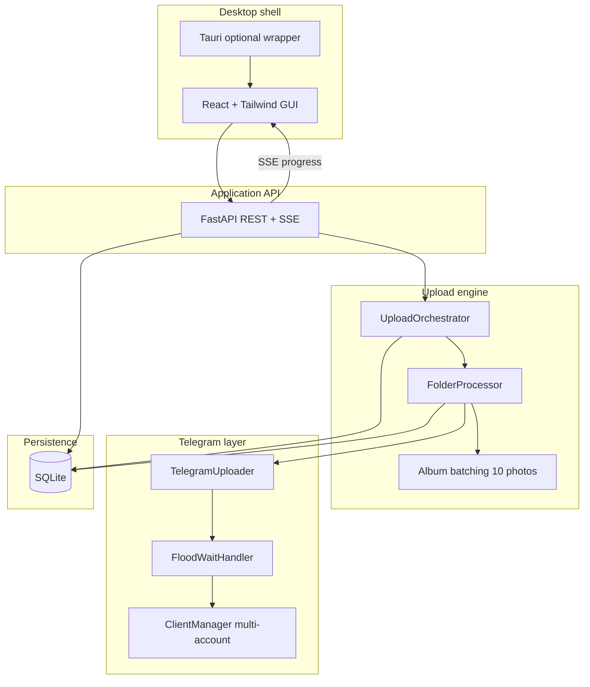
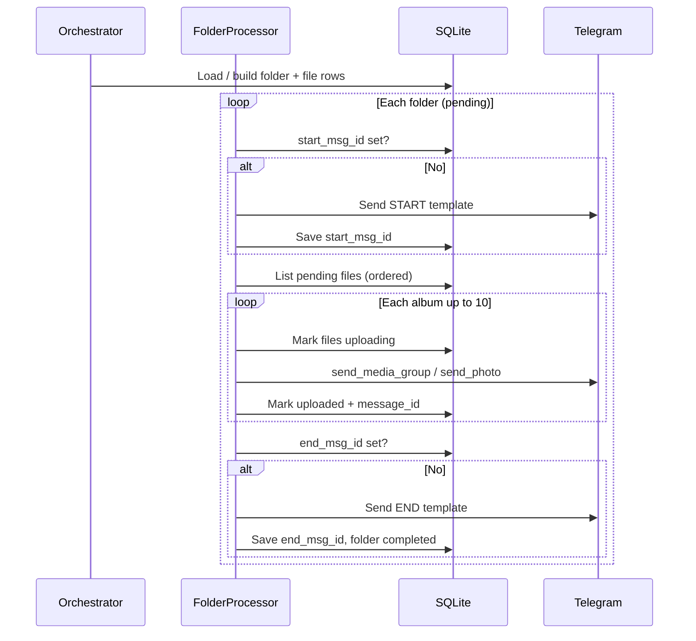
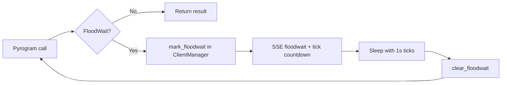

# TeleGallery — System Architecture

This document summarizes how TeleGallery is structured for **gallery-style**, **folder-wise**, **resumable** uploads to Telegram channels (photos as albums, max 10 per media group).

---

## 1. System architecture (high level)

- **GUI** talks only to **FastAPI** (HTTP + SSE). It never imports Pyrogram.
- **Upload engine** runs in the same Python process as FastAPI today, but is **logically separate** (could be split into a worker process or Docker service later).
- **SQLite** is the source of truth for **per-file** state, enabling crash-safe resume.

---

## 2. GUI architecture

| Area | Responsibility |
|------|------------------|
| `pages/Dashboard` | Folder scan, channel/account selection, start/pause/stop |
| `pages/Accounts` | Login, connect, multi-account list |
| `pages/Logs`, `Failed`, `History` | Observability and recovery |
| `store/*` | Zustand stores for upload progress, accounts, logs |
| `hooks/useSSE` | Subscribes to `/api/upload/events` for live progress, floodwait, completion |

**Theming:** CSS variables + Tailwind for light/dark (see `Settings` / `index.css`).

---

## 3. Backend architecture

| Module | Role |
|--------|------|
| `api/*` | REST: upload control, accounts, sessions, logs, folders |
| `engine/orchestrator.py` | Session lifecycle: scan → queue in DB → folder loop |
| `engine/folder_processor.py` | Per-folder: START text → albums → END text |
| `engine/album_batcher.py` | Deterministic album indices (order preserved) |
| `telegram/*` | Pyrogram client pool, album send as **photos**, floodwait wrapper |
| `services/upload_service.py` | Active orchestrator registry, pause/resume/stop |
| `services/event_bus.py` | In-process pub/sub → SSE |
| `db/repositories/*` | Typed data access |

---

## 4. Database schema (logical)

| Table | Purpose |
|-------|---------|
| `accounts` | Telegram credentials + session string + status |
| `upload_sessions` | One “job”: root path, channel, account, counts, status |
| `folders` | Each subfolder queue item; `start_msg_id` / `end_msg_id` prevent duplicate boundaries |
| `files` | **Per-file** status, album index, Telegram `message_id` when uploaded |
| `logs` | Human-readable audit trail |
| `failed_uploads` | Failure records for reporting / retry |

Resume is driven by **`files.status`**, not by album alone.

---

## 5. Upload flow (folder-wise)

---

## 6. Resume strategy

1. On startup of a run, any `files` in `uploading` → `pending` (crash mid-album).
2. **START** is sent only if `folders.start_msg_id` is `NULL`.
3. Pending work is `files` where `status ∈ {pending, uploading}` (after reset), ordered by `order_index`.
4. **END** is sent only if `folders.end_msg_id` is `NULL` and there are no remaining pending files for that folder.
5. Already `uploaded` files are never re-sent; album chunks skip complete files naturally via pending query.

---

## 7. FloodWait strategy

- Wrapper sleeps **Telegram wait + safety buffer** (from `config.yaml`).
- GUI shows countdown via SSE `floodwait` / `floodwait_tick` events.
- **Multi-account failover:** when `upload.failover_on_floodwait` is true (default), if one account receives `FloodWait` and another account is already connected in `ClientManager`, the upload **retries immediately** on the alternate account (SSE `failover` event). Otherwise the usual countdown sleep applies.

---

## 8. Retry strategy

| Layer | Behavior |
|-------|----------|
| **FloodWait** | Infinite automatic retries inside `FloodWaitHandler` (bounded by `max_floodwait` policy). |
| **Album failure** | Files marked `failed`, `failed_uploads` row; user can **Retry Failed** (API resets to `pending` and resumes session). |
| **Network / RPC** | `TelegramUploader.upload_photo_with_retry` uses exponential backoff for single-photo helper paths. |

---

## 9. Repository layout (implementation)

See root `README.md` for the authoritative tree. Highlights:

- `backend/` — FastAPI + engine + Pyrogram (headless-capable).
- `frontend/` — Vite + React + TypeScript + Tailwind.
- `src-tauri/` — Optional native shell (Tauri) wrapping the same UI.

---

## 10. Docker

- `Dockerfile` / `docker-compose.yml` run the **FastAPI backend** headlessly.
- The React GUI is served separately (e.g. `npm run dev` or static build behind a reverse proxy) unless you add a static file stage.

---

## 11. MVP roadmap (suggested)

| Phase | Scope |
|-------|--------|
| **MVP-1** | Scan, accounts, upload, pause/resume/stop, SQLite resume, floodwait, logs (current baseline). |
| **MVP-2** | Tauri packaged desktop, richer history, export failure CSV, round-robin multi-account upload. |
| **MVP-3** | Worker split, optional Redis/event bus for multi-node, metrics endpoint. |

---

## 12. Scalability considerations

- **Very large libraries (500GB+):** SQLite remains viable for **metadata**; bottleneck is Telegram rate limits and sequential uploads, not DB size. Consider WAL mode, batch commits, and optional archival of old `logs` rows.
- **Horizontal scale:** One writer per Telegram account; shard by account, not by file.
- **Future web dashboard:** Expose the same REST + SSE (or WebSocket) contract; reuse repositories behind a thin API layer.

---

## 13. Telegram constraints (enforced)

- Albums capped at **10** photos per `send_media_group`.
- Single leftover photo uses `send_photo` (still appears as a normal channel photo).
- Folder **START/END** messages are plain text markers for human browsing.
